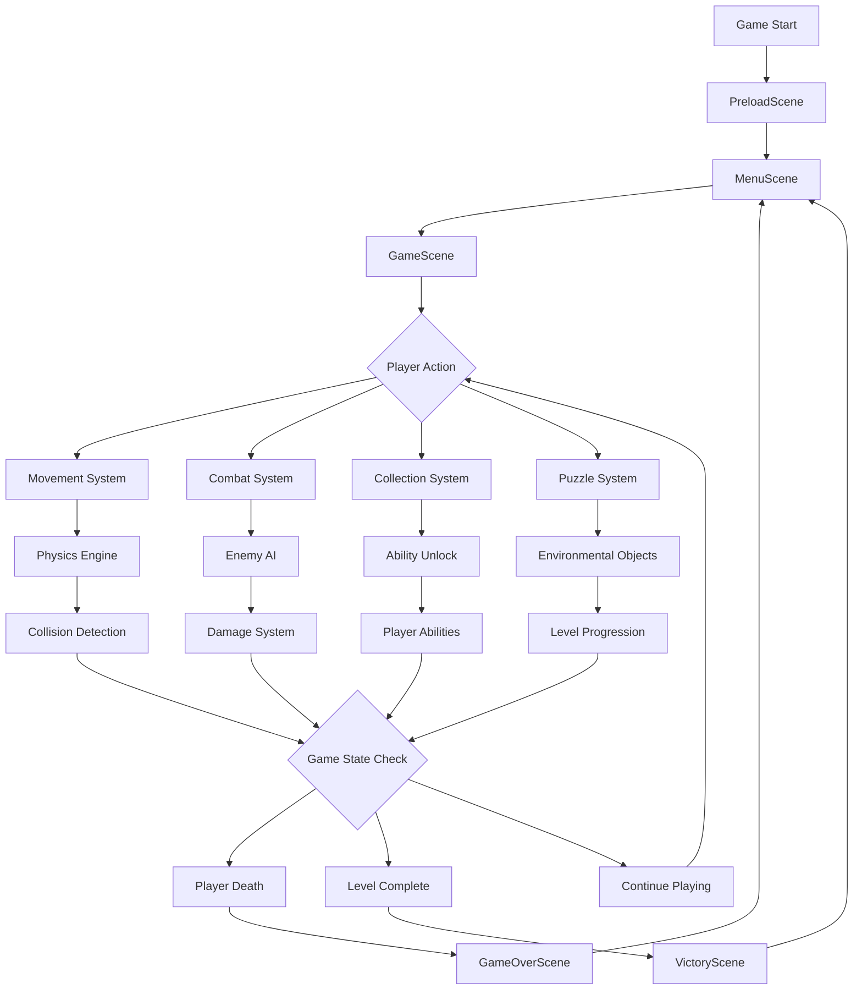
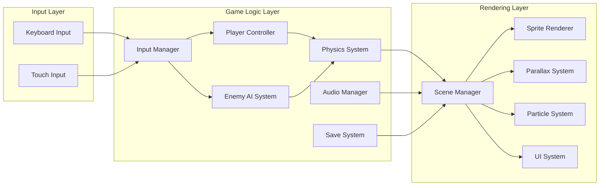
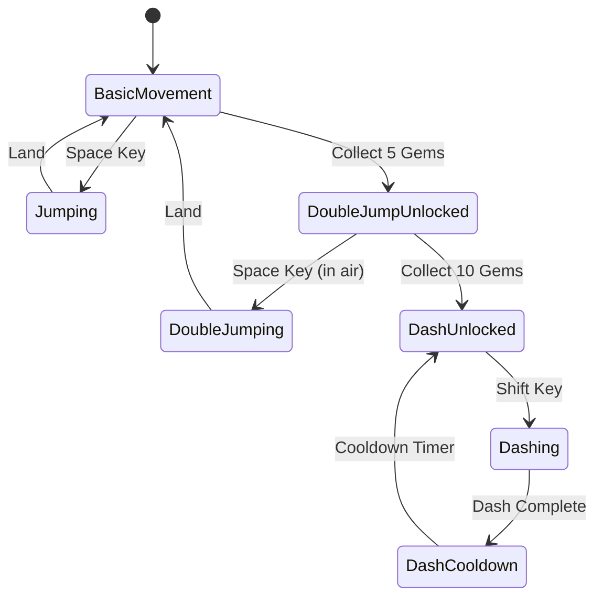
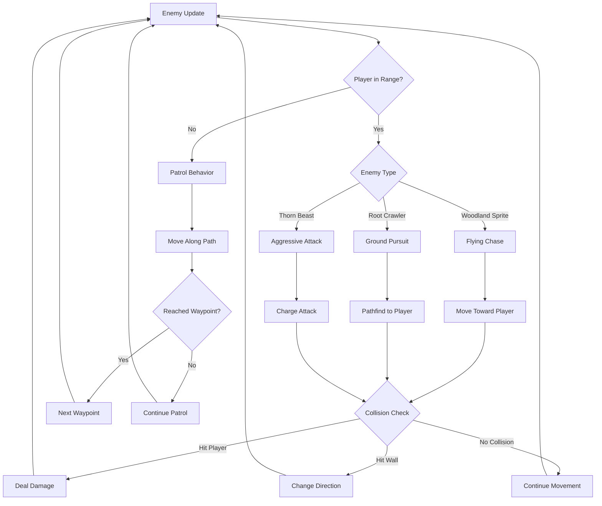
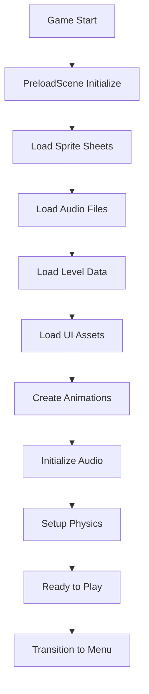
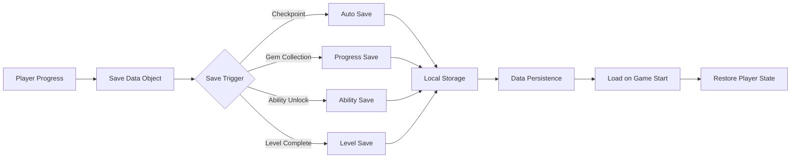

# Forest Guardian Platformer - System Architecture Diagram

## Game Flow Diagram

## Core Systems Architecture

## Player Ability System Flow

## Enemy AI Behavior Tree

## Level Progression System

```mermaid
graph LR
    A[Tutorial Area] --> B[Basic Platforming]
    B --> C[Enemy Introduction]
    C --> D[First Gem Collection]
    D --> E[Double Jump Unlock]
    E --> F[Advanced Platforming]
    F --> G[Environmental Puzzles]
    G --> H[More Gems Collection]
    H --> I[Dash Ability Unlock]
    I --> J[Complex Challenges]
    J --> K[Boss Arena]
    K --> L[Victory]
```

## Asset Loading Pipeline

## Save System Data Flow

This visual representation helps understand how all the game systems interconnect and flow together to create the complete platformer experience.